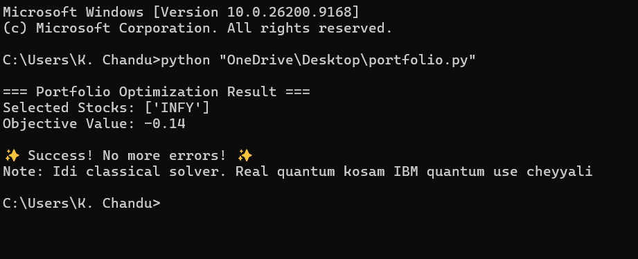

# Quantum Portfolio Optimization 

## Problem Statement
Select the best stocks from 4 Indian companies to maximize profit & minimize risk.

## Result

selected stocks ['INFY'
objective value :-0.14
## HOW TO RUN 
```bash
pip install qiskit qiskit-algorithms qiskit-optimization numpy
python portfolio.py
day 1 of my quantum journey
Next:scaling fack market data using yfinance 
